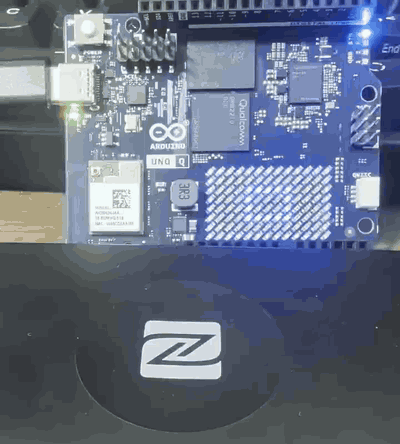
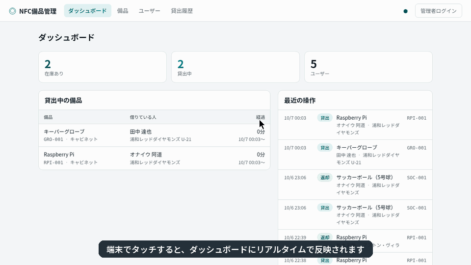

# NFC備品管理

NFCタグを **「ユーザー → 備品」の順にタッチ**して貸出・返却を記録する Arduino UNO Q の App です。結果は LED Matrix に表示し、備品・ユーザー・貸出状況は Web 画面で管理します。

- 設計書：[docs/design.md](docs/design.md)（HTML 版：[docs/src/design.html](docs/src/design.html)）
- 開発者ガイド（開発時・本番の構成、DB、変更の反映方法）：[docs/developer-guide.md](docs/developer-guide.md)（HTML 版：[docs/src/developer-guide.html](docs/src/developer-guide.html)）
  - Markdown 版は GitHub 上でそのまま図も表示されます。HTML 版は同じ内容をダウンロードしてブラウザで開いて読むためのものです
- 機材：Arduino UNO Q、Sony RC-S380、NTAG215 タグ、**給電(PD)付き USB-C ハブ**

## 動作イメージ

### 端末（UNO Q）



RC-S380 にユーザーのタグ、続いて備品のタグをタッチすると、UNO Q の LED Matrix に結果が表示されます。表示パターンの意味は[設計書の LED 表示仕様](docs/design.md#7-led-表示仕様)を参照してください。

### Web 画面



端末でタッチした貸出がダッシュボードにリアルタイムで反映される様子、備品・ユーザー・貸出履歴の一覧、備品とユーザーの登録、項目名の変更（部署 → 課、チーム → 所属クラブ）の順に操作しています。

## 現在の状況

| 項目 | 状況 |
|---|---|
| 実装 | Management（API・DB・Web UI）、Edge、sketch、nfc-agent、Phase 2 用の構成まで完了 |
| 確認済み | テスト 25 件、Web UI の表示、sketch のコンパイル。**実機で App を起動**し、8000 番ポートの公開（PoC #3）と、疑似リーダーから送ったタッチでの貸出・切替・返却・エラー・未登録・登録読取・タイムアウトを確認（2026-09-26）。 **RC-S380 と NTAG215 の実タグでの読取（PoC #1）** を確認し、PD 付きハブ経由で `054c:06c3` を認識、17 回のタッチを取りこぼしなく処理、未登録・貸出・返却・エラー・タイムアウトも動作（2026-09-29）。実タグでの貸出者の切替と［タグを読み取る］での登録読取、LED Matrix の表示の目視確認（2026-09-30） |

## 構成

| 部分 | 場所 | 動く場所 |
|---|---|---|
| nfc-agent | [nfc-agent/](nfc-agent/) | UNO Q 上の別コンテナ。RC-S380 を読み、UID を `:8100` で配信（App コンテナは USB を開けないため） |
| Edge | [python/edge/](python/edge/) | App 内。UID を受け取り、2段階タッチを判定し、LED に表示を指示 |
| Management | [python/management/](python/management/) | App 内のスレッド（Phase 1）→ 管理PC（Phase 2）。業務ルール・DB・API・Web 画面（`:8000`） |
| sketch | [sketch/](sketch/) | MCU。LED Matrix と RGB LED（LED4）の表示 |

## 使い方（Phase 1：UNO Q 1台）

### 1. nfc-agent を起動する（初回だけ）

```bash
cd ~/ArduinoApps/unoq-nfc-lending
docker compose -f nfc-agent/compose.yaml up -d --build
curl localhost:8100/health        # {"reader": true, ...} ならリーダーを認識している
```

`restart: unless-stopped` なので、次からはボードの起動時に自動で立ち上がります。

### 2. App を起動する

```bash
arduino-app-cli app start ~/ArduinoApps/unoq-nfc-lending   # ※ 実行中の別の App は止まります
arduino-app-cli app logs  ~/ArduinoApps/unoq-nfc-lending --follow
```

### 3. Web 画面にログインする

1. PC のブラウザで `http://<UNO Q の IP>:8000/` を開く（閲覧はログインなしでできる）
2. 右上の［管理者ログイン］。ユーザー名は `admin`、初期パスワードは `data/admin_initial_password.txt` に保存されている
3. ［設定］→［パスワードを変更］で変更する

#### パスワードを忘れたとき

ボード上で次のコマンドを実行すると、管理者パスワードをランダムな一時パスワードにリセットします。App の再起動は不要です。

```bash
docker exec -w /app/python unoq-nfc-lending-main-1 /app/.cache/.venv/bin/python -m management reset-password
```

- 一時パスワードは `data/admin_reset_password.txt` に保存される。ログインして［設定］→［パスワードを変更］で変え、ファイルは削除する
- リセット前の DB は `data/backups/` に自動でバックアップされる
- `--password <新しいパスワード>` で直接指定（8文字以上）、`--username <名前>` で対象の管理者を指定できる
- Phase 2 では `docker compose -f deploy/management/compose.yaml exec management python -m management reset-password`

### 4. ユーザーと備品を登録する

1. ［ユーザー］または［備品］→［＋ 追加］
2. ［タグを読み取る］を押し、60秒以内に端末でタグをタッチ → UID が入る（LED は「登録用に読取」）
3. 名前などを入力して保存。あとから［編集］で変更でき、タグの差し替えもできる

登録していないタグをタッチすると［未登録タグ］に記録され、そこからも登録できます。

### 5. 貸出・返却

| 操作 | 結果 |
|---|---|
| ユーザー → 在庫ありの備品 | 貸出 |
| ユーザー → 自分が借りている備品 | 返却 |
| ユーザー → 別の人が借りている備品 | 貸出者を切り替え |

ユーザーをタッチしてから 10 秒以内に備品をタッチします。LED の表示は [設計書 §7](docs/design.md#7-led-表示仕様) を参照してください。

## 設定ファイル `data/app.env`

arduino-app-cli は App に環境変数を渡せないため、設定は `data/app.env`（`KEY=VALUE`、git 対象外）に書きます。Phase 1 では**何も書かなくても動きます**。

| キー | 既定値 | 内容 |
|---|---|---|
| `ADMIN_PASSWORD` | 自動生成 | 初回起動時の管理者パスワード（すでに管理者がいれば使われない） |
| `RUN_MANAGEMENT` | `true` | `false` にすると App 内で Management を起動しない（Phase 2） |
| `MGMT_URL` | `http://127.0.0.1:8000` | Edge の接続先 |
| `DEVICE_ID` / `DEVICE_TOKEN` | `unoq-1` / 自動発行 | 端末の認証。Phase 1 では `data/device_token` に自動で作られる |
| `AGENT_URL` | `http://$HOST_IP:8100` | nfc-agent の接続先 |

実行時に `data/` に作られるもの：`nfc.db`（DB）、`backups/`（毎日のバックアップ7世代）、`device_token`、`admin_initial_password.txt`、`admin_reset_password.txt`（パスワードリセット時のみ）。

## Phase 2：管理機能を別PCへ移す

```bash
# 管理PC（このリポジトリを置いて）
cp <UNO Q の data/nfc.db> deploy/management/data/nfc.db
docker compose -f deploy/management/compose.yaml up -d --build
```

管理PCの Web 画面で［設定］→［端末を追加］してトークンを発行し、UNO Q の `data/app.env` に次を書いて App を再起動します。

```ini
RUN_MANAGEMENT=false
MGMT_URL=http://<管理PC>:8000
DEVICE_ID=unoq-1
DEVICE_TOKEN=<発行されたトークン>
```

## 開発

| 作業 | 方法 |
|---|---|
| テスト | `sh tests/run.sh`（App のベースイメージで一時コンテナを作って実行。起動中の App には影響しない） |
| sketch のコンパイル確認 | App の起動時に自動でビルドされる。キャッシュが古いときは `arduino-app-cli app clean-cache user:unoq-nfc-lending --force` |
| LED のドット絵を変える | `docs/src/gen.py` の `PATTERNS` を編集 → `cd docs/src && python3 gen.py template.html`（設計書の図と `sketch/patterns.h` が両方更新される） |
| 設計書を直す | `docs/design.md` と `docs/src/template.html` の両方を直し、上と同じく `gen.py` を実行 → `docs/src/design.html` が更新される |
| 開発者ガイドを直す | `docs/developer-guide.md` だけ直して `gen.py` を実行（HTML 版は自動生成） |

HTML 版の Mermaid は `<pre class="mmd">` に書き、改行は `&lt;br/&gt;` と書きます（`mermaid` クラスにすると公開先が自動で描画し、日本語フォントの読込前に文字幅を測るため文字が重なります）。
