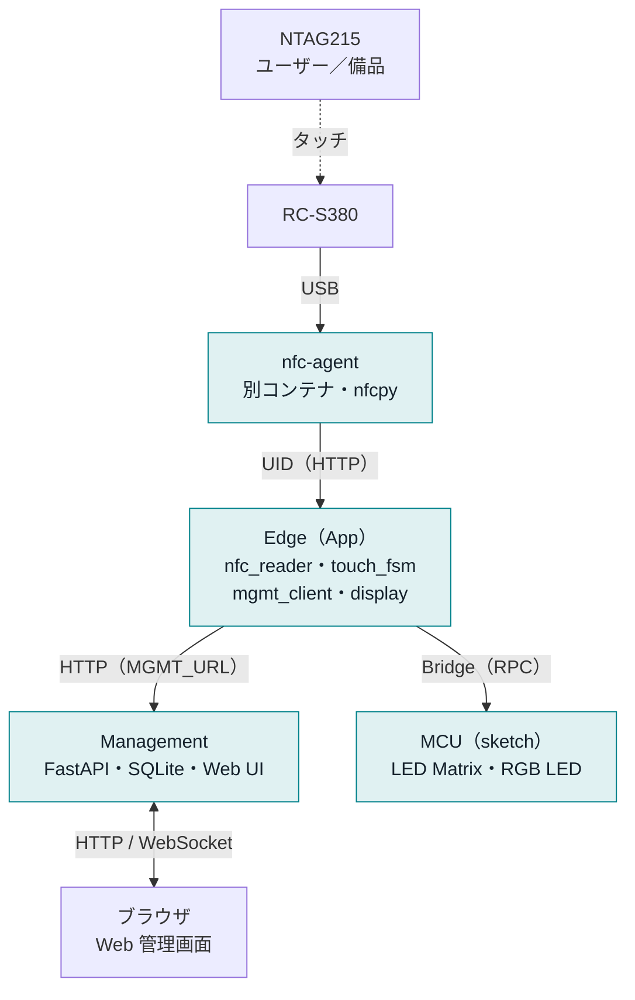
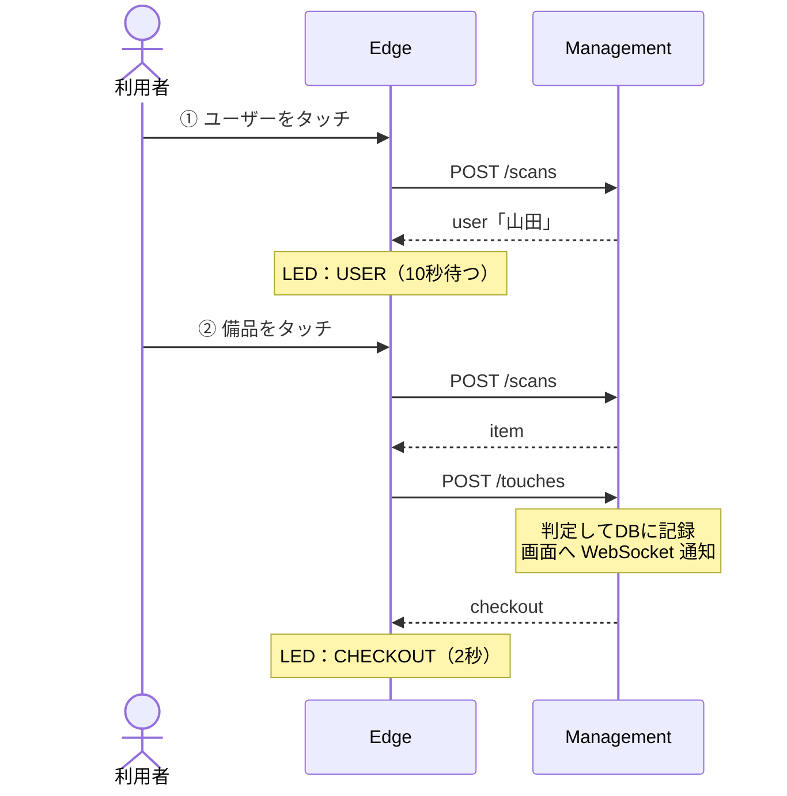
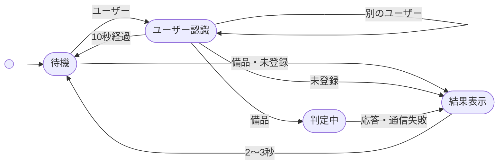
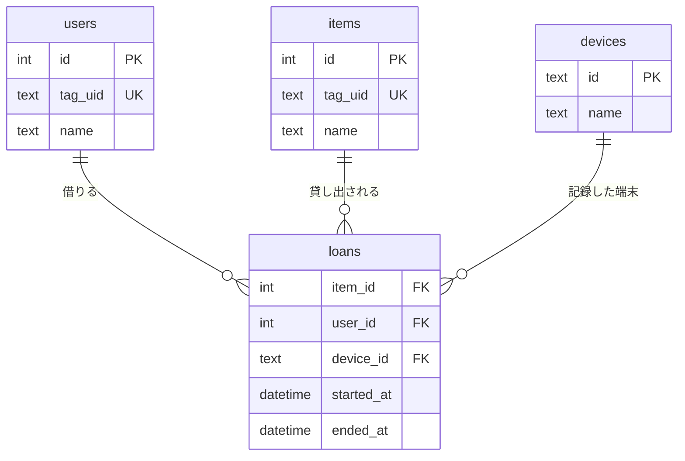

# NFC備品管理システム 設計書

| 項目 | 内容 |
|---|---|
| 版 | 0.4（2026-09-29：PoC #1 の結果を反映。0.3＝2026-09-26：実装に合わせて更新。PoC #2 の結果により NFC 読取は nfc-agent に分離） |
| 対象ハードウェア | Arduino UNO Q、Sony RC-S380、NTAG215 NFCタグ（直径25mm） |
| 状態 | 基本設計。PoCで確認する項目は[§12](#12-リスクとpoc計画)にまとめています |

---

## 1. 概要

ユーザーと備品にNFCタグを貼り、**「ユーザー → 備品」の順にタッチ**するだけで貸出・返却を記録します。結果はLED Matrixに表示し、備品・ユーザー・貸出状況はWeb画面で管理します。


**スコープ**

| 対象 | 対象外（将来検討） |
|---|---|
| タッチによる貸出・返却・貸出者の切替 | 貸出期限・延滞通知（メール/チャット） |
| LED Matrix・RGB LEDでの結果表示 | 予約機能 |
| Webでの備品・ユーザー・履歴・未登録タグの管理 | 端末がオフラインの間の貸出の記録 |
| 管理機能を別PCへ移せる構成 | 外部の認証基盤（SSOなど）との連携 |

---

## 2. 前提条件と確認済み事項

### 2.1 決定事項

| 論点 | 決定 |
|---|---|
| タグの識別 | NTAG215 の **UID（7バイト）だけ**を使う。タグには書き込まない |
| 他人が貸出中の備品をタッチした場合 | **貸出者を切り替える**（前の人は返却扱い、新しい人に貸出） |
| Web画面の権限 | 閲覧は誰でもできる。**登録・編集は管理者ログインが必要** |
| 構成 | Phase 1 は UNO Q 1台に全機能を載せる。Phase 2 で管理機能を別PCへ移す |
| NFCの読取 | App とは**別のコンテナ（nfc-agent）**で動かす。App コンテナからは USB を開けないため（[§12](#12-リスクとpoc計画) PoC #2） |

### 2.2 必要な機材

| 機材 | 備考 |
|---|---|
| Arduino UNO Q | 確認済み（RAM 3.6GB、空きストレージ 14GB） |
| Sony RC-S380（/S または /P） | USB ID `054c:06c3` または `054c:06c1` |
| **給電(PD)付き USB-C ハブ** | **追加で購入が必要。** UNO Q の USB-C は1ポートだけなので、ハブで電源とリーダーを同時につなぐ |
| NTAG215 タグ（10枚） | ユーザーと備品の合計が10を超えるなら追加で購入 |

### 2.3 仮定（違う場合は教えてください）

| 項目 | 仮定した値 |
|---|---|
| 設置する端末 | 1か所・1台（Phase 2 では複数台に対応） |
| 規模 | ユーザー 〜100人、備品 〜300点 |
| ネットワーク | 社内LAN（Wi-Fi）。インターネット接続は不要 |
| 時刻 | UNO Q は NTP で時刻を合わせる。DB には UTC で保存し、画面では JST で表示する |

---

## 3. システム構成

2つの層に分けます。この分け方が、将来の移設を容易にする中心です。

| 層 | 役割 | 配置（Phase 1 → Phase 2） |
|---|---|---|
| **Edge（端末機能）** | タグ読取（nfc-agent）、2段階タッチの状態管理、LED表示 | UNO Q → UNO Q（変わらない） |
| **Management（管理機能）** | 貸出の判定、DB、REST API、Web UI | UNO Q → 管理PC |


色付きの枠は UNO Q 上で動くもの（Phase 1）。


**設計のポイント**

- RC-S380 は **nfc-agent**（`docker compose` で常駐させる別コンテナ）が読み取り、UID を HTTP で Edge に流します。App コンテナには USB を開く権限がないためです（PoC #2）。
- Edge は Management を **常に HTTP で呼びます**。Phase 1 の接続先は `localhost` です。移設するときは `data/app.env` の `MGMT_URL` を変えるだけで済みます（arduino-app-cli は App に環境変数を渡せないため、設定はこのファイルに書く）。
- Management は **Arduino の Brick に依存しない FastAPI の単体アプリ**にします。Phase 1 では App 内のスレッドで uvicorn を起動し、Phase 2 では同じコードを Docker でPC上で動かします。
- 貸出の判定（業務ルール）は **Management だけ**に置きます。端末を増やしてもルールは1か所で済みます。

---

## 4. コンポーネント

| 層 | モジュール | 責務 |
|---|---|---|
| Agent | `nfc-agent/agent.py` | nfcpy で RC-S380 をポーリングしてUIDを取得し、`GET /events`（1行1イベントの NDJSON）で配信する。同じUIDが1.5秒以内に続けて読まれたら無視する（かざしている間の連続読取対策）。リーダーが抜かれても3秒ごとに再接続する。`GET /health` でリーダーの接続状態を返す |
| Edge | `nfc_reader` | nfc-agent の `/events` を購読してUIDを受け取る（接続先 `AGENT_URL`、既定は `http://$HOST_IP:8100`）。切断されたら再接続する。読取方式を差し替えられるよう**アダプタとして分離**する |
| Edge | `touch_fsm` | 「ユーザー → 備品」の状態遷移を管理する（[§5.2](#52-端末の状態遷移)） |
| Edge | `mgmt_client` | Management API の呼出し。タイムアウトは3秒。失敗したら `OFFLINE` を表示する |
| Edge | `display` | `Bridge.notify("show", pattern_id)` で MCU に表示を指示する |
| MCU | `sketch.ino` | 表示パターンを描画する（LED Matrix・RGB LED の LED4）。`patterns.h` は `docs/src/gen.py` の `PATTERNS`（§7 の図と同じドット絵）から生成する。Python から最初の指示が来るまでは何も描かない（起動ロゴを乱さないため） |
| Mgmt | `api` | REST API（`/api/v1`）と WebSocket（`/ws/events`） |
| Mgmt | `service` | 貸出の判定、登録モード、ログイン |
| Mgmt | `repository` | SQLAlchemy でDBにアクセスする（SQLite / PostgreSQL を切り替えられる） |
| Mgmt | `static/` | Web UI（HTML + JavaScript） |

**フォルダ構成**

```text
unoq-nfc-lending/
├── app.yaml               # ports: [8000]、Brick なし
├── python/
│   ├── main.py            # Management をスレッドで起動し、Edge のループを回す
│   ├── edge/              # nfc_reader, touch_fsm, mgmt_client, display, envfile
│   ├── management/        # app, api, service, models, db, security, events, static/（Web UI）
│   └── requirements.txt   # sqlalchemy（fastapi・uvicorn・httpx はベースイメージに同梱）
├── sketch/                # sketch.ino, patterns.h（gen.py で生成）, sketch.yaml
├── nfc-agent/             # agent.py, Dockerfile, compose.yaml（App の外で常駐）
├── deploy/management/     # Phase 2 用の Dockerfile・compose.yaml
├── tests/                 # pytest（sh tests/run.sh）
├── data/                  # 実行時に作られる：DB・バックアップ・端末トークン・app.env（git 対象外）
└── docs/                  # この設計書
```

---

## 5. タッチ操作の流れ

### 5.1 シーケンス（貸出の例）



### 5.2 端末の状態遷移



| いまの状態 | きっかけ | 次の状態 | LED 表示 |
|---|---|---|---|
| 待機 | ユーザーのタグ | ユーザー認識 | USER |
| 待機 | 備品のタグ | 結果表示 | ERROR（先にユーザーをタッチ） |
| 待機・ユーザー認識 | 未登録のタグ | 結果表示 | UNKNOWN（登録モード中は CAPTURED） |
| ユーザー認識 | 別のユーザーのタグ | ユーザー認識（差し替え） | USER |
| ユーザー認識 | 備品のタグ | 判定中 → 結果表示 | CHECKOUT / RETURN / TRANSFER / ERROR。通信失敗は OFFLINE |
| ユーザー認識 | 10秒経過 | 待機 | IDLE |
| 結果表示 | 2〜3秒経過 | 待機 | IDLE |

---

## 6. 業務ルール

`POST /api/v1/touches` で Management が判定します。

| 備品の状態 | タッチしたユーザー | 結果 | 記録する内容 |
|---|---|---|---|
| 在庫あり | 誰でも | **貸出** `checkout` | 貸出を1件追加 |
| 貸出中 | 借りている本人 | **返却** `return` | 貸出を終了（`end_reason=return`） |
| 貸出中 | 別のユーザー | **切替** `transfer` | 今の貸出を終了（`end_reason=transfer`）し、新しい貸出を追加。**1トランザクションで処理する** |
| 無効化されている | — | エラー `error` | なし（無効化されたユーザーの場合も同じ） |

**タグの登録（要件6）**

1. 管理者が Web 画面で「ユーザー追加」または「備品追加」を開き、**［タグを読み取る］**を押す（登録モードが60秒間有効になる）
2. 端末でタグをタッチする → UIDがフォームに自動で入力される（LEDは `CAPTURED`）
3. 名前・部署・保管場所などを入力・修正して保存する。登録後もいつでも編集できる

登録モード以外で未登録のタグがタッチされた場合は「未登録タグ」一覧に記録し、そこからも登録できます。タグを紛失したときは、編集画面で新しいタグを読み取ってUIDを差し替えます（履歴はそのまま残ります）。

---

## 7. LED 表示仕様

LED Matrix（8×13、8段階の明るさ）と RGB LED を組み合わせ、離れた場所からでも結果が分かるようにします。



| パターン | 表示するタイミング | RGB LED | 表示時間 |
|---|---|---|---|
| `IDLE` | タッチ待ち | 青 | 常時（ゆっくり明滅） |
| `USER` | ユーザーを認識した | 青 | 最大10秒（下段のバーが減っていく） |
| `CHECKOUT` / `RETURN` / `TRANSFER` | 貸出・返却・切替に成功した | 緑 | 2秒 |
| `ERROR` | 操作の順番違い、無効化されたタグ | 赤 | 2秒 |
| `UNKNOWN` | 未登録のタグ | 黄 | 2秒 |
| `CAPTURED` | 登録モードでUIDを受け付けた | 水色 | 2秒 |
| `OFFLINE` | Management と通信できない | 赤（点滅） | 3秒 |

- 起動直後の20〜30秒は UNO Q の起動ロゴが出ているため、sketch はその後に描画を始めます。
- Bridge は `notify`（応答を待たない）を使い、タッチへの反応を遅らせません。

---

## 8. データモデル



| テーブル | 内容 | 列 |
|---|---|---|
| `users` | ユーザー | id, **tag_uid**（例 04A1B2C3D4E5F6）, name, department, team（チーム）, note, active, created_at, updated_at |
| `items` | 備品 | id, **tag_uid**, name, asset_no（管理番号。空でなければ一意）, category, location（保管場所）, note, active, created_at, updated_at |
| `loans` | 貸出の記録 | id, item_id, user_id, device_id, started_at, **ended_at**（NULL なら貸出中）, end_reason（return / transfer / admin） |
| `devices` | 端末 | id, name, token_hash, last_seen_at |
| `unknown_tags` | 未登録タグ | uid, device_id, first_seen_at, last_seen_at |
| `admins` | 管理者 | id, username, password_hash |
| `app_settings` | Web 画面から変える設定 | key, value（JSON）。`fields` に項目名の設定を保存する |

- `tag_uid` は users と items をまたいで一意にします（同じタグを両方に登録できないよう、サービス層で確認する）。
- 貸出中かどうかは `loans.ended_at IS NULL` で判断します。1つの備品に貸出中の行は1つまでです（部分ユニークインデックス）。
- 削除は `active=false`（論理削除）で行います。履歴は消えません。
- department・team・asset_no・category・location の**画面上の項目名**は現場ごとに変えられます（例：部署 → 課、チーム → 社員種別）。無効にした項目は画面に表示しません。変わるのは表示と CSV の見出しだけで、列名と保存済みの値はそのままです。

---

## 9. API

ベースパスは `/api/v1` です。「利用者」列は、呼び出すのに必要な権限を表します。

| 利用者 | メソッド・パス | 内容 |
|---|---|---|
| 端末（トークン） | `POST /scans` | UIDの種類を問い合わせる → `user` / `item` / `unknown` / `captured` |
| 端末（トークン） | `POST /touches` | 貸出の判定と記録 → `checkout` / `return` / `transfer` / `error` |
| 端末（トークン） | `POST /devices/{id}/heartbeat` | 死活監視（60秒ごと） |
| 誰でも | `GET /items`・`GET /users`・`GET /loans`・`GET /loans.csv` | 一覧と検索（状態、期間、ユーザー、備品で絞込み）、CSV 出力 |
| 誰でも | `GET /fields` | 項目名の設定（ユーザー・備品の各項目の名前と、有効かどうか） |
| 誰でも | `GET /summary` | ダッシュボード用の件数と最近の操作 |
| 誰でも | `WS /ws/events` | タッチ・貸出・返却をリアルタイムで通知 |
| 管理者（ログイン） | `POST`・`PATCH /items`、`/users` | 登録・編集・無効化 |
| 管理者（ログイン） | `POST /registration-sessions` | 登録モードを開始する（UIDを受け取るまで待つ） |
| 管理者（ログイン） | `POST /loans/{id}/close` | 管理者による強制返却（`end_reason=admin`） |
| 管理者（ログイン） | `GET`・`DELETE /unknown-tags` | 未登録タグの確認と削除 |
| 管理者（ログイン） | `GET`・`POST`・`DELETE /devices` | 端末の一覧・追加（トークン発行）・削除 |
| 管理者（ログイン） | `PATCH /fields` | 項目名の変更・項目の有効／無効 |
| 管理者（ログイン） | `GET /backup` | DB のバックアップをダウンロード |
| — | `POST /auth/login`・`/auth/logout`・`/auth/password`、`GET /auth/me` | 管理者のログイン（セッションCookie）とパスワード変更 |

---

## 10. Web 画面

| 画面 | 誰が使うか | 主な内容 |
|---|---|---|
| ダッシュボード | 全員 | 貸出中の一覧（誰が・いつから）、在庫数、最近の操作（リアルタイム更新） |
| 備品 | 全員（編集は管理者） | 一覧・検索、状態バッジ（在庫あり／貸出中／無効）、追加・編集 |
| ユーザー | 全員（編集は管理者） | 一覧、そのユーザーが借りている備品、追加・編集 |
| 貸出履歴 | 全員 | 期間・ユーザー・備品で絞込み、CSV出力 |
| 未登録タグ | 管理者 | 読み取られた未登録のUID → ユーザーまたは備品として登録 |
| 設定 | 管理者 | 端末の一覧と状態、項目名の変更、管理者パスワードの変更、DBのバックアップ |

---

## 11. 移行方針（Phase 1 → Phase 2）

| 手順 | 作業 |
|---|---|
| 1 | 管理PCで `docker compose -f deploy/management/compose.yaml up -d --build` を実行する（同じコード。`DATABASE_URL` で PostgreSQL にも切り替えられる） |
| 2 | UNO Q の `data/nfc.db` を管理PCの `deploy/management/data/` にコピーする（SQLite のまま使う場合） |
| 3 | 管理PCの Web 画面（設定 → 端末を追加）でトークンを発行し、UNO Q の `data/app.env` に `MGMT_URL`・`DEVICE_ID`・`DEVICE_TOKEN` を書く |
| 4 | 同じファイルに `RUN_MANAGEMENT=false` を書いて App を再起動する。nfc-agent は UNO Q に残す（変更なし） |

**非機能要件**

| 項目 | 目標 |
|---|---|
| 応答性 | 備品をタッチしてから結果が表示されるまで1秒以内 |
| データ保全 | SQLite のバックアップを毎日取得（7世代） |
| セキュリティ | パスワードはハッシュ化して保存する。端末トークンと管理者パスワードは `data/app.env`（git 対象外）か自動生成ファイルに置き、ソースや `app.yaml` には書かない |

---

## 12. リスクとPoC計画

| # | リスク | 結果 | 対応 |
|---|---|---|---|
| 1 | UNO Q が USB ホストとして RC-S380 を認識できない | ✅ **OK（確認済み）** | PD 付き USB-C ハブ経由で `054c:06c3`（RC-S380/P）として認識され、nfc-agent が nfcpy で開けた。NTAG215 の実タグ3枚で17回タッチし、すべて App まで届いた（2026-09-29） |
| 2 | App コンテナから USB デバイスにアクセスできない | ❌ **NG（確認済み）** | 下記のとおり nfc-agent を別コンテナに分離した（**採用済み**） |
| 3 | `app.yaml` の `ports` で 8000番を公開できない | ✅ **OK（確認済み）** | 実装した App を起動し、`0.0.0.0:8000` で待ち受けて LAN の IP から Web 画面と API に届くことを確認した |

**PoC #2 で分かったこと**

| 確認内容 | 結果 |
|---|---|
| App のコンテナ設定 | `arduino-app-cli` が生成する compose の `device_cgroup_rules` は **226・506・81・116 に固定**（CLI に組み込み）。`app.yaml` に追加する項目はない |
| 実際にブロックされるか | App コンテナ内で、グループ権限はあるが許可リスト外の `/dev/gpiochip0`（major 254）を開く → **`EPERM`**。USB（major 189）も同様にブロックされる |
| 別コンテナなら開けるか | `--device-cgroup-rule 'c 254:* rmw'` を付けた別コンテナでは**開ける** → nfc-agent に `c 189:* rmw` を付けて解決 |
| nfcpy が動くか | nfcpy 1.0.4 をインストールできる。ただし App のベースイメージに libusb がないため、nfc-agent は `python:3.13-slim` + `libusb-1.0-0` で作る |
| App から nfc-agent に届くか | App コンテナから `http://$HOST_IP:8100/health` に届く |
| カーネルとの競合 | RC-S380 を使うカーネルドライバ `port100` は入っていない（blacklist の設定は不要） |
