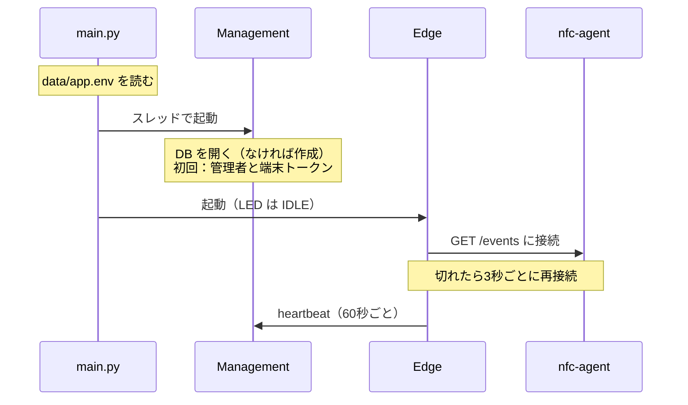

# NFC備品管理 開発者ガイド

開発時と本番で、アプリと DB がどこでどう動いているかをまとめます。使い方は [README](../README.md)、設計の理由は [設計書](design.md) を参照してください。

---

## 1. 構成要素

動くものは 4 つです（プロセスの単位では [§2](#2-プロセスとプログラムの構成)）。どれも UNO Q の上で別々に起動・停止します。

| 構成要素 | 実体 | 起動するもの | コード |
|---|---|---|---|
| **nfc-agent** | Docker コンテナ（`nfc-agent:latest`） | `docker compose -f nfc-agent/compose.yaml up -d`。以後はボード起動時に自動で起動 | [nfc-agent/](../nfc-agent/) |
| **App** | Docker コンテナ（`unoq-nfc-lending-main-1`） | `arduino-app-cli app start`。compose は CLI が `.cache/app-compose.yaml` に生成する | [python/](../python/) |
| ├ Edge | App のメインスレッド | `python/main.py` | [python/edge/](../python/edge/) |
| └ Management | App 内のスレッド（uvicorn） | `python/main.py`（`RUN_MANAGEMENT=false` なら起動しない） | [python/management/](../python/management/) |
| **sketch** | MCU のファームウェア | `app start` のときにビルドして書き込まれる | [sketch/](../sketch/) |

nfc-agent を App と分けているのは、**App コンテナから USB デバイスを開けない**ためです（arduino-app-cli が付けるデバイスの許可リストに USB が入っていない。[設計書 §12](design.md#12-リスクとpoc計画)）。

---

## 2. プロセスとプログラムの構成

### プロセスとスレッド


- **Management は App の中**です。App コンテナの Python プロセス（`python main.py`）は1つだけで、Edge と Management は同じプロセスの別スレッドとして動きます。
- **nfc-agent は別のコンテナ**（別プロセス）です。App コンテナからは USB を開けないため分けています。
- Edge と Management は同じプロセスにありますが、関数を直接呼ばず `http://127.0.0.1:8000` を HTTP で呼びます。Phase 2 と同じ経路にしておき、移設するときは接続先を変えるだけで済むようにするためです。
- `arduino-router` はボード標準のホスト側プロセスで、Bridge（Python ↔ sketch）の通信を中継します。

| スレッド | 役割 | コード |
|---|---|---|
| メイン | `App.run()` のループ。届いた UID を状態機械に渡し、タイムアウトを判定する | `main.py` → `edge/touch_fsm.py` |
| nfc-reader | nfc-agent の `/events` を受信し続け、UID をキューに入れる | `edge/nfc_reader.py` |
| heartbeat | 60秒ごとにリーダーの接続状態を Management に報告する | `edge/nfc_reader.py`（`poll_forever`） |
| management | uvicorn の Web サーバー。API・Web UI・WebSocket を処理する | `management/app.py` |
| スレッドプール | API の処理（FastAPI の標準の仕組み） | `management/api.py` |
| backup | 1時間ごとに確認し、1日1回 DB を保存する | `management/app.py`（`Backups`） |

### プログラム部品

```text
python/
├─ main.py              起動処理：設定を読む → Management スレッドを起動 → Edge を組み立ててループを回す
├─ edge/                端末側（Arduino に依存するのは display だけ）
│   ├─ touch_fsm.py     ★中心。「ユーザー → 備品」の状態機械。通信先と表示は外から渡す
│   ├─ nfc_reader.py    nfc-agent から UID を受け取る（読取方法を変えるときはここだけ直す）
│   ├─ mgmt_client.py   Management API の呼び出し（HTTP、タイムアウト3秒）
│   ├─ display.py       Bridge.notify("show", …) で sketch に表示を指示する
│   └─ envfile.py       data/app.env を読み込む
└─ management/          管理側（Arduino に依存しない。python -m management で単体でも起動できる）
    ├─ app.py           組み立て：DB・サービス・API をつなぐ、初回の自動設定、バックアップ
    ├─ api.py           HTTP の入口：REST API・WebSocket・認証チェック
    ├─ service.py       ★中心。業務ルール（貸出・返却・切替の判定）、登録モード、CRUD
    ├─ models.py        テーブル定義（SQLAlchemy）
    ├─ db.py            DB 接続（SQLite の設定を含む）
    ├─ security.py      パスワードのハッシュ化、トークン、ログイン状態
    ├─ events.py        画面へのリアルタイム通知（WebSocket への配信）
    └─ static/          Web UI（HTML・JS・CSS）

nfc-agent/agent.py      別コンテナ：リーダーを読み、UID を HTTP で配信する（RC-S380 は nfcpy で読む）
nfc-agent/pcsc.py       同上の PC/SC 方式（ZW-12026-12 などの CCID リーダー。pcscd をコンテナ内で動かす）
nfc-agent/fake_agent.py 開発用の疑似リーダー（POST /inject で UID を流す）
sketch/sketch.ino       MCU：LED Matrix と RGB LED の表示（patterns.h は gen.py で生成）
```

**依存の向き**

| 層 | 依存の向き | ねらい |
|---|---|---|
| Management | `api` → `service` → `models`・`db` | 業務ルールを `service` に集める。HTTP の都合（認証・入力チェック）は `api` だけに置く |
| Edge | `main` が `touch_fsm` に `mgmt_client` と `display` を渡す | 状態機械は I/O を知らない。テストでは偽物に差し替えて、ハードウェアなしで検証できる |
| Edge ↔ Management | HTTP だけ（Python の import はしない） | Management を別の PC に移せるようにする |

---

## 3. 動作形態の一覧

| 形態 | 動くもの | DB | 設定 | ポート |
|---|---|---|---|---|
| 開発 ① 単体テスト | 一時コンテナの pytest | SQLite（テストごとに一時ファイル） | テストコード内 | なし |
| 開発 ② 実機 ＋ 疑似リーダー | App ＋ 疑似リーダー ＋ sketch | `data/nfc.db`（本番と同じ） | `data/app.env`（任意） | 8000・8100 |
| 開発 ③ Management 単体 | management コンテナ | `deploy/management/data/nfc.db` | 環境変数・`.env` | 8000 |
| **本番 Phase 1** | nfc-agent ＋ App（Edge＋Management） ＋ sketch | `data/nfc.db` | `data/app.env`（任意） | 8000・8100 |
| **本番 Phase 2** | UNO Q：nfc-agent ＋ App（Edge）＋ sketch ／ 管理PC：management | 管理PC の SQLite か PostgreSQL | UNO Q：`data/app.env`（必須） ／ 管理PC：`.env` | 8000（管理PC）・8100 |

---

## 4. 開発時の構成


### ① 単体テスト

```bash
sh tests/run.sh              # 引数は pytest に渡る（例：-k touch）
```

- App と同じベースイメージ（`python-apps-base`）に sqlalchemy と pytest を入れた一時コンテナで実行します。**起動中の App には影響しません。**
- Management のテストは、テストごとに一時ディレクトリへ SQLite を作り、FastAPI の TestClient で API を呼びます。
- Edge のテストは、Management API と LED を偽物に置き換えて状態遷移だけを検証します（HTTP・Bridge は使わない）。

### ② 実機の App ＋ 疑似リーダー

リーダーがなくても、実機の App・LED・Web 画面をまとめて確認できます。

```bash
# 本物の nfc-agent が動いていれば止める（同じ 8100 番を使うため）
docker compose -f nfc-agent/compose.yaml down
# 疑似リーダーを起動
docker run --rm -d --name nfc-fake-agent -p 8100:8100 -v "$PWD/nfc-agent":/agent:ro \
    nfc-agent:latest python3 -u /agent/fake_agent.py
# App を起動（実行中の別の App は先に止める）
arduino-app-cli app start ~/ArduinoApps/unoq-nfc-lending
# タッチを再現
curl -X POST "localhost:8100/inject?uid=04A1B2C3D4E501"
```

- 疑似リーダー（[fake_agent.py](../nfc-agent/fake_agent.py)）は本物の nfc-agent と同じ HTTP を話し、`POST /inject` で UID を流します。
- DB は本番と同じ `data/nfc.db` です。試したデータを消すときは App を止めて `data/` を削除します。
- Edge は切断されると 3 秒ごとに再接続します。**再接続の前に送ったタッチは失われる**ので、ログに `connected to nfc-agent` が出てから送ります。

### ③ Management 単体（Web UI・API の開発）

```bash
docker compose -f deploy/management/compose.yaml up -d --build
docker compose -f deploy/management/compose.yaml logs -f
```

- Phase 2 と同じ構成で、Management だけを PC でも UNO Q でも起動できます。DB は `deploy/management/data/nfc.db` です。
- Web UI（`static/`）はイメージに含まれるため、変更したら `up -d --build` で作り直します。
- 端末からの操作は、Web 画面の［設定］→［端末を追加］で発行したトークンを使い、curl で `/api/v1/scans`・`/api/v1/touches` を呼んで再現します。

---

## 5. 本番の構成


### Phase 1：UNO Q 1台

| 項目 | 内容 |
|---|---|
| App コンテナ | イメージ `python-apps-base`。App のフォルダが `/app` にマウントされ、`python/main.py` が実行される。ユーザーは `arduino`（uid 1000） |
| Python パッケージ | fastapi・uvicorn・httpx はイメージに同梱。`requirements.txt`（sqlalchemy）は初回起動時に `.cache/.venv` へ入る |
| DB | `/app/data/nfc.db`（ボード上の `~/ArduinoApps/unoq-nfc-lending/data/nfc.db`）。App を作り直しても消えない |
| Edge → Management | 同じコンテナ内で `http://127.0.0.1:8000` を HTTP で呼ぶ（Phase 2 と同じ経路） |
| Edge → nfc-agent | `http://$HOST_IP:8100/events`（NDJSON のストリーム） |
| Edge → sketch | `Bridge.notify("show", パターン番号, 表示ミリ秒)` |
| 外部公開 | `app.yaml` の `ports: [8000]` → ボードの 8000 番。8100 番は nfc-agent が公開 |

起動の流れ（`python/main.py`）：



### Phase 2：管理機能を管理PCへ

| 項目 | UNO Q | 管理PC |
|---|---|---|
| 動くもの | nfc-agent、App（Edge のみ）、sketch | management コンテナ（[deploy/management/](../deploy/management/)） |
| 設定 | `data/app.env` に `RUN_MANAGEMENT=false`・`MGMT_URL`・`DEVICE_ID`・`DEVICE_TOKEN` | `deploy/management/.env` に `ADMIN_PASSWORD`・（任意）`DATABASE_URL` |
| DB | 持たない | `deploy/management/data/nfc.db`、または PostgreSQL |
| 認証 | 端末トークン（`Authorization: Bearer`） | 端末トークンを SHA-256 で保存。管理者は Cookie セッション |

移行手順は [README](../README.md#phase-2管理機能を別pcへ移す) にあります。

---

## 6. DB

| 項目 | 内容 |
|---|---|
| 接続先 | `DATABASE_URL`。未指定なら `sqlite:///<DATA_DIR>/nfc.db`。`DATA_DIR` の既定は App 内なら `/app/data`、それ以外は実行したフォルダの `data/` |
| テーブルの作成 | 起動時に SQLAlchemy の `create_all` で、**ないテーブルだけ**作る |
| SQLite の設定 | WAL モード（`nfc.db-wal`・`nfc.db-shm` ができる）、外部キー有効、ロック待ち 5 秒 |
| 一意性の保証 | 1つの備品に貸出中の行は1つまで（部分ユニークインデックス）。タグ UID の重複はサービス層で確認 |
| バックアップ | 1時間ごとに確認し、1日1回 `data/backups/nfc-daily-YYYYMMDD.db` を作成（7世代）。Web 画面からも取得できる |
| テーブル定義 | [management/models.py](../python/management/models.py)、項目の一覧は [設計書 §8](design.md#8-データモデル) |

**注意**

- **マイグレーションの仕組みはありません。** 既存のテーブルに列を追加・変更しても反映されません。開発中は `data/` を消して作り直し、本番データがある場合は `ALTER TABLE` を手で実行します（必要になったら Alembic を導入する）。
- **PostgreSQL にするには、ドライバの追加が必要です。** `requirements.txt` に `psycopg[binary]` を足し、`DATABASE_URL=postgresql+psycopg://...` を指定します。
- **Management は 1 プロセスで動かします。** 管理者のログイン状態と登録モード（タグ読取の待ち）はメモリにあるため、uvicorn のワーカーを増やすと動作がおかしくなります。再起動するとログインし直しになります。

---

## 7. 変更したときの反映方法

| 変更したもの | 反映・確認の方法 |
|---|---|
| `python/management/*.py`・`python/edge/*.py` | `sh tests/run.sh` → `arduino-app-cli app restart ~/ArduinoApps/unoq-nfc-lending` |
| `python/management/static/`（Web UI） | App：ブラウザを再読込するだけ（ファイルを毎回ディスクから読む）。③ の形態では `up -d --build` が必要 |
| `python/requirements.txt` | `app restart`（差分があれば起動時に入る） |
| `sketch/*` | `app restart`（ビルドと書き込みも行う）。古いままなら `arduino-app-cli app clean-cache user:unoq-nfc-lending --force` |
| LED のドット絵 | `docs/src/gen.py` の `PATTERNS` → `cd docs/src && python3 gen.py template.html` → `app restart` |
| `nfc-agent/*.py` | `sh tests/run.sh`（`tests/test_agent.py`）→ `docker compose -f nfc-agent/compose.yaml up -d --build` |
| `data/app.env` | `app restart` |
| このガイド | `developer-guide.md` だけ直して `gen.py` を実行（HTML 版 `docs/src/developer-guide.html` は Markdown から生成される） |
| 設計書 | `design.md` と `docs/src/template.html` の両方を直して `gen.py` を実行 → `docs/src/design.html` が更新される |

ログの見方：Python は `arduino-app-cli app logs ~/ArduinoApps/unoq-nfc-lending --follow`、nfc-agent は `docker compose -f nfc-agent/compose.yaml logs -f`。

---

## 8. ハマりどころ

| 症状・場面 | 原因と対処 |
|---|---|
| `app start` がエラーになる | 別の App が動いている。`arduino-app-cli app stop <その App>` してから起動する |
| App に環境変数を渡したい | arduino-app-cli には渡す手段がない。`data/app.env` に書く（本物の環境変数があればそちらが優先） |
| LED が何も表示しない | sketch は Python から最初の指示が来るまで描画しない（起動ロゴを乱さないため）。App のログで Edge が起動しているか確認する |
| Bridge の呼び出しが何も起きない | `notify` は失敗しても通知されない。Python の `Bridge.notify("show", …)` と sketch の `Bridge.provide("show", …)` の名前が一致しているか確認する |
| テスト後に root 所有の `__pycache__` が残る | `docker run` を root で実行したため。`sh tests/run.sh` を使う（自分の uid で、バイトコードを書かずに実行する） |
| HTML 版の図の文字が重なる | Mermaid は `<pre class="mmd">` に書き、改行は `&lt;br/&gt;` と書く |
